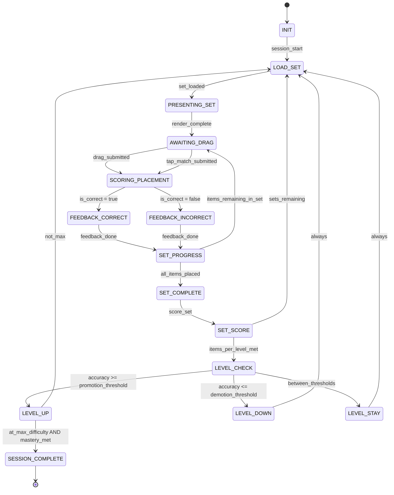

# Engine State Machine: MATCH_SORT_CLASSIFY

## Overview

Match/Sort/Classify presents a set of items and bins (or pairs). The child drags or taps to sort items into categories, match pairs, or classify by property. Scoring happens per-placement and at set completion.

---

## State Diagram

---

## States

| State | Description | Client renders |
|---|---|---|
| `INIT` | Load skill spec, select seed, init difficulty | Loading spinner |
| `LOAD_SET` | Pick next content set (DragBinsSet or MatchPairsSet) | Loading indicator |
| `PRESENTING_SET` | Send PromptPayload to client with full set | Bins/pairs layout, draggable items |
| `AWAITING_DRAG` | Waiting for drag or tap-match interaction | Active drag/match widget |
| `SCORING_PLACEMENT` | Evaluate single placement against correct_bin_map / pair match | N/A (instant) |
| `FEEDBACK_CORRECT` | Snap item to correct position, play correct sound, award Stars | ✅ snap animation + chime |
| `FEEDBACK_INCORRECT` | Return item to source, play incorrect sound | ❌ bounce-back animation |
| `SET_PROGRESS` | Check if more items remain in current set | N/A (instant) |
| `SET_COMPLETE` | All items placed correctly (or max attempts exhausted) | Set completion animation |
| `SET_SCORE` | Calculate set accuracy, update stats | Accuracy display |
| `LEVEL_CHECK` | Evaluate against promotion/demotion thresholds | N/A (instant) |
| `LEVEL_UP/DOWN/STAY` | Adjust difficulty level | Level transition animation |
| `SESSION_COMPLETE` | Mastery achieved | 🏆 mastery celebration |

---

## Template-Specific Behavior

### DragBins (sort/classify)
- Child drags items from a pool into labeled bins
- Each placement is independently scored
- Item snaps into bin on correct, bounces back on incorrect
- After max incorrect for an item (2), show correct bin with highlight

### MatchPairs (matching)
- Child taps/drags to connect left-right pairs
- Both items highlight on correct match
- Shakes on incorrect, deselects
- All pairs must be matched to complete set

---

## Guards & Actions

### SCORING_PLACEMENT
- DragBins: `correct_bin_map[item_id] === target_bin_id`
- MatchPairs: `pairs.find(p => p.left === selected_left && p.right === selected_right)`
- Stars: awarded per correct placement (stars_per_correct * streak multiplier)

### SET_COMPLETE
- All items correctly placed → score = placements_correct / total_items
- Streak bonus: if ALL items correct on first try → bonus stars

### LEVEL_CHECK
- Same logic as MICRO_SKILL_DRILL mastery gate
- `sets_completed` counted instead of `items_completed`
