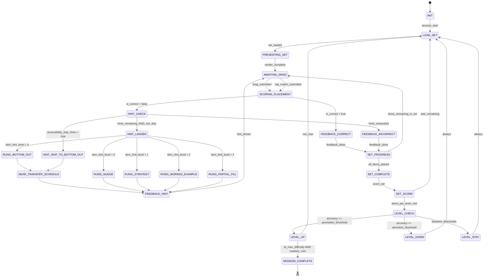

# Engine State Machine: MATCH_SORT_CLASSIFY
> **Version:** v1.1 — updated for hint ladder (5 rungs), near-transfer scheduling, and TriadMode transitions.

## Overview

Match/Sort/Classify presents a set of items and bins (or pairs). The child drags or taps to sort items into categories, match pairs, or classify by property. Scoring happens per-placement and at set completion.

v1.1 adds: a 5-rung hint ladder per item-within-set (each mis-placed item tracks its own `hint_level`), near-transfer scheduling on bottom-out for the set, accessibility skip path, and mode-switch hooks.

---

## State Diagram



---

## States

| State | Description | Client renders |
|---|---|---|
| `INIT` | Load skill spec, select seed, init difficulty | Loading spinner |
| `LOAD_SET` | Pick next content set (DragBinsSet or MatchPairsSet); reset all item hint_levels | Loading indicator |
| `PRESENTING_SET` | Send PromptPayload to client with full set | Bins/pairs layout, draggable items |
| `AWAITING_DRAG` | Waiting for drag or tap-match interaction | Active drag/match widget |
| `SCORING_PLACEMENT` | Evaluate single placement against correct_bin_map / pair match | N/A (instant) |
| `FEEDBACK_CORRECT` | Snap item to correct position, play correct sound, award Stars | ✅ snap animation + chime |
| `FEEDBACK_INCORRECT` | Return item to source, play incorrect sound | ❌ bounce-back animation |
| `HINT_CHECK` | Checks hints remaining for this item; checks accessibility_skip_hints | N/A (instant) |
| `HINT_LADDER` | Selects rung from `HINT_RUNGS[item_hint_level]` | N/A (instant) |
| `RUNG_NUDGE` | Rung 1: "listen to the ending sound" style hint | Hint text overlay on item |
| `RUNG_STRATEGY` | Rung 2: strategy hint ("try sorting by sound family") | Hint text |
| `RUNG_WORKED_EXAMPLE` | Rung 3: shows a correctly-sorted example item in another bin | Example highlight |
| `RUNG_PARTIAL_FILL` | Rung 4: animates item toward correct bin; child confirms placement | Guided drag animation |
| `RUNG_BOTTOM_OUT` | Rung 5: snaps item to correct position; triggers near-transfer for set | Placement reveal |
| `HINT_SKIP_TO_BOTTOM_OUT` | Accessibility path: jump to RUNG_BOTTOM_OUT directly | Placement reveal |
| `NEAR_TRANSFER_SCHEDULE` | Queues a near-transfer follow-up set (same skill, different surface) | N/A (instant) |
| `FEEDBACK_HINT` | Shows hint payload; emits `hint.rung_served` telemetry | Hint overlay |
| `SET_PROGRESS` | More items in current set? | N/A (instant) |
| `SET_COMPLETE` | All items placed (correctly or with bottom-out reveals) | Set completion animation |
| `SET_SCORE` | Calculate set accuracy, update stats | Accuracy display |
| `LEVEL_CHECK` | Evaluate promotion/demotion | N/A (instant) |
| `LEVEL_UP/DOWN/STAY` | Adjust difficulty level | Level transition animation |
| `SESSION_COMPLETE` | Mastery achieved | 🏆 mastery celebration |

---

## Engine State Shape (v1.1)

```typescript
interface MatchSortClassifyState {
    session_id: string;
    skill_id: string;
    engine_type: 'MATCH_SORT_CLASSIFY';

    // Set tracking
    current_content_id: string | null;    // content_id of current DragBinsSet or MatchPairsSet
    queue: string[];                       // set content_ids; near-transfer set inserted at queue[1]

    // Per-item hint tracking (reset per set load)
    // key = item_id within the current set; value = hint_level for that item
    item_hint_levels: Record<string, number>;

    // Near-transfer (v1.1) — applies at set level (one set triggers near-transfer for the next set)
    near_transfer_scheduled: boolean;
    near_transfer_content_id: string | null;

    // Scoring (set-level)
    sets_completed: number;
    sets_correct: number;         // sets where all items placed correctly on first try
    difficulty_level: number;
    streak: number;

    // Misconception tracking (optional; keyed by item_id)
    misconception_patterns: Record<string, string | null>;
}
```

> **Note:** `hint_level` is tracked **per item** within a set (stored in `item_hint_levels[item_id]`). Near-transfer is scheduled at the **set level** when any item in the set bottom-outs.

---

## Template-Specific Behavior

### DragBins (sort/classify)
- Child drags items from a pool into labeled bins
- Each placement is independently scored
- Item snaps into bin on correct, bounces back on incorrect
- After `RUNG_BOTTOM_OUT` for an item: item auto-snaps to correct bin; near-transfer flag raised

### MatchPairs (matching)
- Child taps/drags to connect left-right pairs
- Both items highlight on correct match
- Shakes on incorrect, deselects
- `RUNG_PARTIAL_FILL` highlights the left item's correct right partner

---

## Guards & Actions

### HINT_CHECK (per item)
- Lookup `item_hint_level = item_hint_levels[item_id] ?? 0`
- If `child_policy.accessibility_skip_hints = true` → HINT_SKIP_TO_BOTTOM_OUT
- Else if `item_hint_level < hint_policy.max_hints_per_item` → HINT_LADDER
- Else → FEEDBACK_INCORRECT

### HINT_LADDER (per item)
- Select `rung = HINT_RUNGS[item_hint_level]`
- Increment `item_hint_levels[item_id]`
- Emit `hint.rung_served` with rung name and item_id

### NEAR_TRANSFER_SCHEDULE (set level)
- Triggered when any item in a set reaches RUNG_BOTTOM_OUT
- Select near-transfer set from `skill_spec.near_transfer_pool` (different content_id, same skill)
- Set `near_transfer_scheduled = true`, `near_transfer_content_id = selected_id`
- Insert `selected_id` at `queue[1]`
- Emit `hint.near_transfer_scheduled`

### LOAD_SET
- Pop `queue[0]` as `current_content_id`
- Reset `item_hint_levels = {}`
- Reset `misconception_patterns = {}`
- Reset `near_transfer_scheduled = false`, `near_transfer_content_id = null`

### SET_COMPLETE
- All items placed (correctly OR via bottom-out reveal)
- `set_accuracy = correctly_placed_first_try / total_items`
- If ALL items correct on first try → streak bonus stars

### LEVEL_CHECK
- `accuracy = sets_correct / sets_completed`
- Same threshold logic as MICRO_SKILL_DRILL mastery gate

---

## TriadMode Transition Points (v1.1)

| Transition | Trigger | Engine behavior |
|---|---|---|
| Talk → Practice | Mode switch | Engine begins from current `queue[]`; any in-flight set restarts |
| Practice → Play | Mode switch | Engine wraps into game loop using `bundle.play_config`; same set pool |
| Play → Talk | Mode switch | Engine pauses; talk session begins |
| Any → Pause | Pause | `engine_state` snapshot written to DB (includes `item_hint_levels`) |
| Resume | Session restore | All state restored; `item_hint_levels` preserved per item |

> **Invariant:** `bundle_id` does **not** change on mode switch.

---

## Telemetry Events Emitted

| Event | When |
|---|---|
| `hint.requested` | On every HINT_CHECK dispatch |
| `hint.rung_served` | On FEEDBACK_HINT (includes item_id, rung 1–5, rung_name) |
| `hint.bottom_out_reached` | On RUNG_BOTTOM_OUT |
| `hint.near_transfer_scheduled` | On NEAR_TRANSFER_SCHEDULE |
| `session.mode_switched` | On mode switch (emitted by orchestrator) |
| `flag.misconception_loop` | When same item reaches bottom-out on ≥ 3 consecutive sets |
