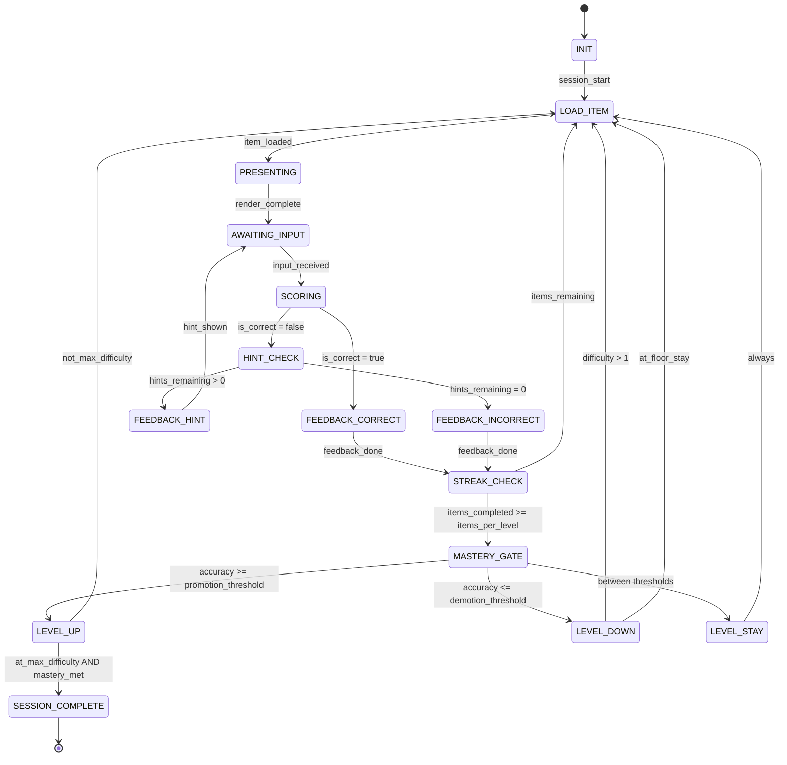

# Engine State Machine: MICRO_SKILL_DRILL

## Overview

The Micro-Skill Drill presents one item at a time (tap, type, or voice). The child answers, gets scored, receives feedback, and advances through a difficulty ladder toward mastery.

---

## State Diagram

---

## States

| State | Description | Client renders |
|---|---|---|
| `INIT` | Engine loads skill spec, selects random seed, initializes difficulty level | Loading spinner |
| `LOAD_ITEM` | Selects next content item from pool (difficulty-filtered) | Loading indicator |
| `PRESENTING` | Sends PromptPayload to client | Widget (TapChoice / TypeInBlank) |
| `AWAITING_INPUT` | Waiting for InteractionEvent from child | Active widget with input enabled |
| `SCORING` | Evaluates interaction against answer key | N/A (instant) |
| `FEEDBACK_CORRECT` | Plays correct sound, awards Stars, updates streak | ✅ animation + Star counter |
| `FEEDBACK_INCORRECT` | Plays incorrect sound, resets streak | ❌ animation |
| `HINT_CHECK` | Checks if hints remain based on hint_policy | N/A (instant) |
| `FEEDBACK_HINT` | Shows hint (text/audio/highlight/eliminate_wrong) | Hint overlay on widget |
| `STREAK_CHECK` | Checks progress against items_per_level | N/A (instant) |
| `MASTERY_GATE` | Evaluates accuracy against promotion/demotion thresholds | N/A (instant) |
| `LEVEL_UP` | Increases difficulty level, plays level_up sound | 🎉 level-up celebration |
| `LEVEL_DOWN` | Decreases difficulty level | Encouraging message |
| `LEVEL_STAY` | Keeps same level, resets item counter | Brief progress feedback |
| `SESSION_COMPLETE` | Mastery achieved at max difficulty | 🏆 mastery celebration + Star bonus |

---

## Guards & Actions

### SCORING
- `is_correct` = evaluate `answer_key_logic.method` on interaction value
- Update `items_correct`, `items_attempted`
- If correct: `streak.current++`, Stars += `stars_per_correct * streak.multiplier`
- If incorrect: `streak.current = 0`
- Streak multiplier: 1x (1-2), 1.5x (3-4), 2x (5-9), 3x (10+)

### HINT_CHECK
- Guard: `hints_used_for_item < hint_policy.max_hints_per_item`
- If hint used: apply `hint_penalty` to score for this item
- Select hint: check `misconceptions[]` for pattern match, else generic

### MASTERY_GATE
- `accuracy = items_correct / items_attempted`
- `accuracy >= promotion_threshold` → LEVEL_UP
- `accuracy <= demotion_threshold` → LEVEL_DOWN
- Otherwise → LEVEL_STAY
- Reset `items_correct`, `items_attempted` for next level

### SESSION_COMPLETE
- Trigger: `difficulty_level == max_difficulty AND mastery_threshold met`
- Award `stars_mastery_bonus`
- Record mastery timestamp to session stats
