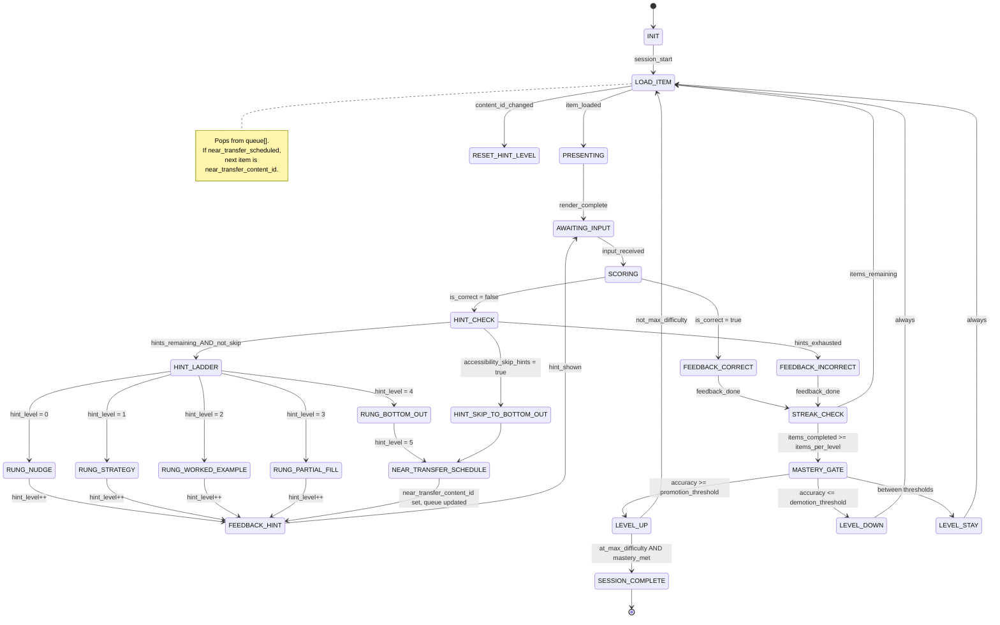

# Engine State Machine: MICRO_SKILL_DRILL
> **Version:** v1.1 — updated for hint ladder (5 rungs), near-transfer scheduling, and TriadMode transitions.

## Overview

The Micro-Skill Drill presents one item at a time (tap, type, or voice). The child answers, gets scored, receives feedback, and advances through a difficulty ladder toward mastery.

v1.1 adds: a 5-rung hint ladder (`hint_level` tracked per content item), near-transfer scheduling on bottom-out, accessibility skip-hints bypass, and mode-switch hooks for Talk ↔ Practice ↔ Play.

---

## State Diagram



---

## States

| State | Description | Client renders |
|---|---|---|
| `INIT` | Engine loads skill spec, selects random seed, initializes difficulty level | Loading spinner |
| `LOAD_ITEM` | Pops next content_id from `queue[]`; resets `hint_level` to 0 if content_id changed | Loading indicator |
| `RESET_HINT_LEVEL` | Guard action on LOAD_ITEM: set `hint_level = 0`, `near_transfer_scheduled = false` on item change | N/A (instant) |
| `PRESENTING` | Sends PromptPayload to client | Widget (TapChoice / TypeInBlank) |
| `AWAITING_INPUT` | Waiting for InteractionEvent from child | Active widget with input enabled |
| `SCORING` | Evaluates interaction against answer key | N/A (instant) |
| `FEEDBACK_CORRECT` | Plays correct sound, awards Stars, updates streak | ✅ animation + Star counter |
| `FEEDBACK_INCORRECT` | Plays incorrect sound, resets streak | ❌ animation |
| `HINT_CHECK` | Checks: (a) hints remain per policy; (b) accessibility_skip_hints flag | N/A (instant) |
| `HINT_LADDER` | Selects rung from `HINT_RUNGS[hint_level]`; dispatches to rung state | N/A (instant) |
| `RUNG_NUDGE` | Rung 1: misconception-matched hint text; generic if no pattern match | Hint text overlay |
| `RUNG_STRATEGY` | Rung 2: step-by-step strategy for the skill (e.g. "sound out each letter") | Hint text + audio |
| `RUNG_WORKED_EXAMPLE` | Rung 3: a solved model of the same item type | Worked example panel |
| `RUNG_PARTIAL_FILL` | Rung 4: partial answer pre-filled; child completes remainder | Widget with filled slots |
| `RUNG_BOTTOM_OUT` | Rung 5: correct answer revealed; triggers near-transfer scheduling | Answer reveal + encourage |
| `HINT_SKIP_TO_BOTTOM_OUT` | Accessibility path: `accessibility_skip_hints = true` → jump to RUNG_BOTTOM_OUT directly | Answer reveal (no ladder) |
| `NEAR_TRANSFER_SCHEDULE` | Sets `near_transfer_scheduled = true`, selects `near_transfer_content_id` from pool, inserts at `queue[1]` | N/A (instant) |
| `FEEDBACK_HINT` | Shows hint payload; emits `hint.rung_served` telemetry | Hint overlay on widget |
| `STREAK_CHECK` | Checks progress against `items_per_level` | N/A (instant) |
| `MASTERY_GATE` | Evaluates accuracy against promotion/demotion thresholds | N/A (instant) |
| `LEVEL_UP` | Increases difficulty level, plays level_up sound | 🎉 level-up celebration |
| `LEVEL_DOWN` | Decreases difficulty level | Encouraging message |
| `LEVEL_STAY` | Keeps same level, resets item counter | Brief progress feedback |
| `SESSION_COMPLETE` | Mastery achieved at max difficulty | 🏆 mastery celebration + Star bonus |

---

## Engine State Shape (v1.1)

```typescript
interface MicroSkillDrillState {
    session_id: string;
    skill_id: string;
    engine_type: 'MICRO_SKILL_DRILL';

    // Item tracking
    current_content_id: string | null;
    queue: string[];               // content_ids; near-transfer inserted at index 1 on bottom-out

    // Scoring
    items_attempted: number;
    items_correct: number;
    streak: number;
    difficulty_level: number;

    // Hint ladder (v1.1)
    hint_level: number;                       // 0-based index; resets to 0 on content_id change
    near_transfer_scheduled: boolean;
    near_transfer_content_id: string | null;  // set on RUNG_BOTTOM_OUT

    // Misconception tracking (for RUNG_NUDGE)
    misconception_pattern: string | null;

    // Mode (v1.1 — managed by session, not engine)
    // current_mode lives on the session record, not inside engine_state.
}
```

---

## Guards & Actions

### SCORING
- `is_correct` = evaluate `answer_key_logic.method` on interaction value
- Update `items_correct`, `items_attempted`
- If correct: `streak.current++`, Stars += `stars_per_correct * streak.multiplier`
- If incorrect: `streak.current = 0`
- Streak multiplier: 1× (1-2), 1.5× (3-4), 2× (5-9), 3× (10+)

### HINT_CHECK
- If `child_policy.accessibility_skip_hints = true` → dispatch HINT_SKIP_TO_BOTTOM_OUT
- Else if `hint_level < hint_policy.max_hints_per_item` → dispatch HINT_LADDER
- Else → dispatch FEEDBACK_INCORRECT (hints exhausted)

### HINT_LADDER (rung selection)
- Identify rung: `HINT_RUNGS[hint_level]` = `['nudge', 'strategy', 'worked_example', 'partial_fill', 'bottom_out'][hint_level]`
- For RUNG_NUDGE: check `skill_spec.misconceptions[]` for a pattern matching `misconception_pattern`; use generic if none
- Increment `hint_level` in returned engine_state
- Emit `hint.rung_served` telemetry with `rung`, `rung_name`, `hint_level_after`

### NEAR_TRANSFER_SCHEDULE
- Triggered by: RUNG_BOTTOM_OUT or HINT_SKIP_TO_BOTTOM_OUT
- Query near-transfer pool from `skill_spec.near_transfer_pool`:
  - Strategy `content_id_list`: pick first entry != `current_content_id`
  - Strategy `query`: query DB for `skill_id = X AND content_id != current AND difficulty_level = current`
- If pool empty: trigger `ContentGenJob` (async); use curated fallback if available
- Set `near_transfer_scheduled = true`
- Set `near_transfer_content_id = selected_id`
- Insert `selected_id` at `queue[1]` (immediately after current item in queue)
- Emit `hint.near_transfer_scheduled` telemetry

### LOAD_ITEM / RESET_HINT_LEVEL
- Pop `queue[0]` for next `current_content_id`
- If new `content_id ≠ prev content_id`:
  - `hint_level = 0`
  - `near_transfer_scheduled = false`
  - `near_transfer_content_id = null`
  - `misconception_pattern = null`

### MASTERY_GATE
- `accuracy = items_correct / items_attempted`
- `accuracy >= promotion_threshold` → LEVEL_UP
- `accuracy <= demotion_threshold` → LEVEL_DOWN
- Otherwise → LEVEL_STAY
- Reset `items_correct`, `items_attempted` for next level

### SESSION_COMPLETE
- Trigger: `difficulty_level == max_difficulty AND mastery_threshold met`
- Award `stars_mastery_bonus`
- Record mastery timestamp to session stats

---

## TriadMode Transition Points (v1.1)

The engine itself is **mode-agnostic** — it processes interactions regardless of `current_mode`. Mode is managed by the session orchestrator.

| Transition | Trigger | Engine behavior |
|---|---|---|
| Talk → Practice | `POST /sessions/{id}/switch-mode {mode: "practice"}` | Engine continues from current `queue[]` state; no reset |
| Practice → Play | `POST /sessions/{id}/switch-mode {mode: "play"}` | Engine wraps into game loop using `bundle.play_config`; same item pool |
| Play → Talk | `POST /sessions/{id}/switch-mode {mode: "talk"}` | Engine pauses active item; talk session begins |
| Any → Pause | `POST /sessions/{id}/pause` | `engine_state` snapshot written to DB |
| Resume | `GET /sessions/{id}` | `engine_state` restored from DB; queue and hint_level preserved |

> **Invariant:** `bundle_id` does **not** change on mode switch. The same `LearningBundle` governs all three modes for the life of the session.

---

## Telemetry Events Emitted

| Event | When |
|---|---|
| `hint.requested` | On every HINT_CHECK dispatch |
| `hint.rung_served` | On FEEDBACK_HINT (includes rung 1–5 and rung_name) |
| `hint.bottom_out_reached` | On RUNG_BOTTOM_OUT |
| `hint.near_transfer_scheduled` | On NEAR_TRANSFER_SCHEDULE |
| `session.mode_switched` | On mode switch (emitted by orchestrator, not engine) |
| `flag.misconception_loop` | When `hint_level >= 3` on same item for ≥ 3 consecutive items |
