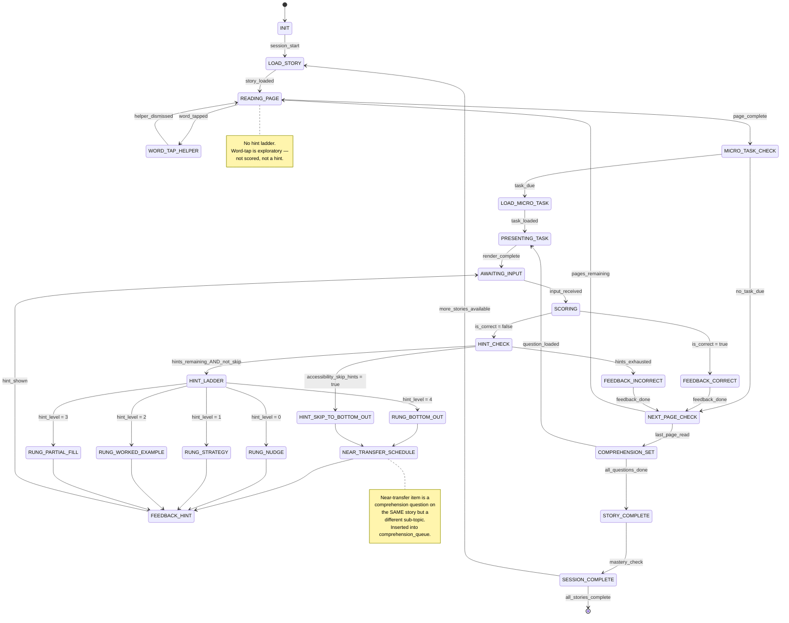

# Engine State Machine: STORY_MICROTASKS
> **Version:** v1.1 — updated for hint ladder (5 rungs) on micro-task items, near-transfer scheduling, and TriadMode transitions.

## Overview

Story+Micro-Tasks presents a story page-by-page with read-aloud support, tap-word helpers, and embedded micro-tasks (comprehension questions, vocabulary checks) between pages.

v1.1 adds: a 5-rung hint ladder for comprehension/micro-task items (not for story pages themselves), near-transfer scheduling on bottom-out of any comprehension item, accessibility skip path, and mode-switch hooks.

> **Design invariant:** Hint ladder applies **only** to `PRESENTING_TASK` (comprehension questions and micro-task items). Story pages (`READING_PAGE`) and word-tap helpers (`WORD_TAP_HELPER`) are **never** subject to hints — they are exploratory, not scored.

---

## State Diagram



---

## States

| State | Description | Client renders |
|---|---|---|
| `INIT` | Load skill spec, select story from content pool | Loading spinner |
| `LOAD_STORY` | Load all StoryPages + ComprehensionQs for selected story_id; reset hint_level | Pre-loading content |
| `READING_PAGE` | Display story page with highlighted read-aloud, tappable words | Story text + illustration |
| `WORD_TAP_HELPER` | Show definition, sound-it-out, or audio for tapped word — **not a hint** | Popup overlay on word |
| `MICRO_TASK_CHECK` | Check if a micro-task is due (every N pages or at insertion points) | N/A (instant) |
| `LOAD_MICRO_TASK` | Select appropriate micro-task; reset `hint_level = 0` for this item | Loading |
| `PRESENTING_TASK` | Show ComprehensionQ or TapChoiceItem | Question widget |
| `AWAITING_INPUT` | Wait for child answer | Active widget |
| `SCORING` | Evaluate answer | N/A (instant) |
| `HINT_CHECK` | Checks hints remaining for this task item; checks accessibility_skip_hints | N/A (instant) |
| `HINT_LADDER` | Selects rung from `HINT_RUNGS[hint_level]` | N/A (instant) |
| `RUNG_NUDGE` | Rung 1: point back to relevant story text ("Can you find the answer in the story?") | Hint text overlay |
| `RUNG_STRATEGY` | Rung 2: reading strategy hint ("Look for who did the action") | Hint text |
| `RUNG_WORKED_EXAMPLE` | Rung 3: highlight the sentence in the story that contains the answer | Story text highlight |
| `RUNG_PARTIAL_FILL` | Rung 4: eliminate wrong choices (for multiple-choice comprehension) | Choices dimmed/eliminated |
| `RUNG_BOTTOM_OUT` | Rung 5: reveal correct answer + explanation; trigger near-transfer scheduling | Answer reveal panel |
| `HINT_SKIP_TO_BOTTOM_OUT` | Accessibility path: jump to RUNG_BOTTOM_OUT | Answer reveal panel |
| `NEAR_TRANSFER_SCHEDULE` | Queues a near-transfer comprehension question (same story, different sub-topic) | N/A (instant) |
| `FEEDBACK_HINT` | Shows hint; emits `hint.rung_served` | Hint overlay |
| `FEEDBACK_CORRECT` | Stars + correct feedback | ✅ animation |
| `FEEDBACK_INCORRECT` | Incorrect feedback; no hint (hints exhausted) | ❌ animation |
| `NEXT_PAGE_CHECK` | More pages remaining? | N/A (instant) |
| `COMPREHENSION_SET` | End-of-story comprehension questions (sequence of ComprehensionQs) | Question sequence |
| `STORY_COMPLETE` | All questions answered, calculate story score | Story completion celebration |
| `SESSION_COMPLETE` | Check mastery threshold against stories | 🏆 or next story prompt |

---

## Engine State Shape (v1.1)

```typescript
interface StoryMicroTasksState {
    session_id: string;
    skill_id: string;
    engine_type: 'STORY_MICROTASKS';

    // Story tracking
    current_story_id: string | null;
    story_queue: string[];          // story content_ids to process in session
    current_page_index: number;
    pages_read_since_last_task: number;
    task_interval: number;          // pages between micro-tasks (from skill spec)

    // Task item tracking — per micro-task / comprehension question
    current_task_content_id: string | null;
    comprehension_queue: string[];  // content_ids for end-of-story questions; near-transfer inserted here

    // Hint ladder (v1.1) — per task item (NOT per story page)
    hint_level: number;                       // resets to 0 on each new task item
    near_transfer_scheduled: boolean;
    near_transfer_content_id: string | null;

    // Scoring
    tasks_attempted: number;
    tasks_correct: number;
    stories_completed: number;
    stories_mastered: number;
    difficulty_level: number;
    streak: number;

    // Misconception (for RUNG_NUDGE matching on comprehension questions)
    misconception_pattern: string | null;
}
```

---

## Read-Aloud Flow

1. Page loads → TTS begins reading via OpenAI Realtime API (or pre-generated audio)
2. Words highlight in sequence as read (synchronized via `word_spans` timing)
3. Child can tap any word to pause read-aloud and open Word Tap Helper
4. Word Tap Helper shows: definition, sound-it-out phonemes, and "hear it" button
   - **Word Tap Helper does NOT count as a hint; it does NOT increment `hint_level`**
   - Word-tap events ARE logged to `session_events` for analytics
5. Dismissing helper resumes read-aloud from current position
6. Child taps "Next" or swipes to advance page

---

## Micro-Task Insertion

- Micro-tasks appear every `task_interval` pages (default: 2–3; configurable per skill spec in `spec_data.task_interval`)
- Task types: vocabulary check ("What does ___ mean?"), quick comprehension ("What happened to ___?")
- Insertion points can also be specified in `StoryPage` metadata (`micro_task_id` field)
- Stars earned per correct micro-task answer
- Each micro-task item has its own `hint_level` (reset on new task_content_id)

---

## Comprehension Set (End-of-Story)

- 2-4 `ComprehensionQ` items per story
- Mix of `question_types`: `literal`, `inference`, `vocabulary`, `sequence`
- Each question scored with hint ladder (5 rungs)
- Near-transfer scheduling: a bottom-out on any comprehension question inserts an alternative question (same story, different sub-topic OR same skill, next story) into `comprehension_queue`
- Story mastery = `story_accuracy >= mastery_threshold.min_accuracy` across micro-tasks + comprehension

---

## Guards & Actions

### HINT_CHECK (per task item)
- If `child_policy.accessibility_skip_hints = true` → HINT_SKIP_TO_BOTTOM_OUT
- Else if `hint_level < hint_policy.max_hints_per_item` → HINT_LADDER
- Else → FEEDBACK_INCORRECT

### HINT_LADDER (per task item)
- Select `rung = HINT_RUNGS[hint_level]`
- For `RUNG_NUDGE`: check `misconceptions[]` for pattern; fallback to "Look at the story again"
- For `RUNG_WORKED_EXAMPLE` (comprehension): highlight the key sentence in the story that contains the answer
- For `RUNG_PARTIAL_FILL` (multiple-choice): eliminate 1-2 wrong choices
- Increment `hint_level`
- Emit `hint.rung_served`

### NEAR_TRANSFER_SCHEDULE
- Triggered by RUNG_BOTTOM_OUT or HINT_SKIP_TO_BOTTOM_OUT on a task item
- Near-transfer for story engine = a comprehension question with same `skill_id` and `story_id` but different `content_id`
   (OR a question from the next story if no alternatives remain in current story)
- Insert at `comprehension_queue[1]` (immediately after current question)
- Set `near_transfer_scheduled = true`, `near_transfer_content_id = selected_id`
- Emit `hint.near_transfer_scheduled`

### LOAD_MICRO_TASK / RESET
- Set `current_task_content_id = task_content_id`
- Reset `hint_level = 0`
- Reset `near_transfer_scheduled = false`
- Reset `near_transfer_content_id = null`
- Reset `misconception_pattern = null`

### MICRO_TASK_CHECK
- `pages_read_since_last_task >= task_interval`
- OR `current_page.micro_task_id` is set

### STORY_COMPLETE
- `story_accuracy = tasks_correct / tasks_attempted` (micro-tasks + comprehension)
- Stars: per correct answer + story completion bonus
- If `story_accuracy >= mastery_threshold.min_accuracy` → story mastered → `stories_mastered++`

---

## TriadMode Transition Points (v1.1)

| Transition | Trigger | Engine behavior |
|---|---|---|
| Talk → Practice | Mode switch | Engine begins story from `story_queue[0]`; any in-flight page restarts from page 0 |
| Practice → Play | Mode switch | Engine wraps story play into game loop using `bundle.play_config` (story_page widget) |
| Play → Talk | Mode switch | Engine pauses; talk session begins |
| Any → Pause | Pause | Full `engine_state` snapshot written to DB (includes page_index, task queue, hint_level) |
| Resume | Session restore | All state restored; story page and hint progress preserved |

> **Invariant:** `bundle_id` does **not** change on mode switch. The same story content is used in Practice and Play modes.

---

## Telemetry Events Emitted

| Event | When |
|---|---|
| `hint.requested` | On every HINT_CHECK dispatch (task items only) |
| `hint.rung_served` | On FEEDBACK_HINT (task content_id, rung 1–5, rung_name) |
| `hint.bottom_out_reached` | On RUNG_BOTTOM_OUT (task item) |
| `hint.near_transfer_scheduled` | On NEAR_TRANSFER_SCHEDULE |
| `session.mode_switched` | On mode switch (emitted by orchestrator) |
| `flag.misconception_loop` | When same misconception pattern on ≥ 3 consecutive task items |
