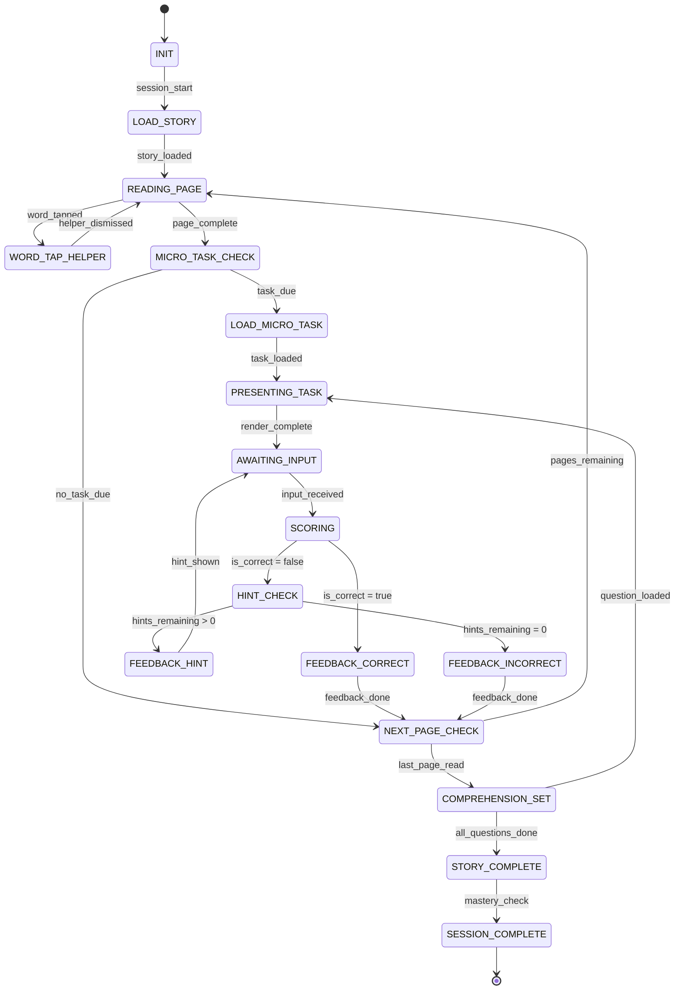

# Engine State Machine: STORY_MICROTASKS

## Overview

Story+Micro-Tasks presents a story page-by-page with read-aloud support, tap-word helpers, and embedded micro-tasks (comprehension questions, vocabulary checks) between pages.

---

## State Diagram

---

## States

| State | Description | Client renders |
|---|---|---|
| `INIT` | Load skill spec, select story from content pool | Loading spinner |
| `LOAD_STORY` | Load all StoryPages + ComprehensionQs for selected story_id | Pre-loading content |
| `READING_PAGE` | Display story page with highlighted read-aloud, tappable words | Story text + illustration |
| `WORD_TAP_HELPER` | Show definition, sound-it-out, or audio for tapped word | Popup overlay on word |
| `MICRO_TASK_CHECK` | Check if a micro-task is due (every N pages or at insertion points) | N/A (instant) |
| `LOAD_MICRO_TASK` | Select appropriate micro-task (vocab check, simple comprehension) | Loading |
| `PRESENTING_TASK` | Show ComprehensionQ or TapChoiceItem | Question widget |
| `AWAITING_INPUT` | Wait for child answer | Active widget |
| `SCORING` | Evaluate answer | N/A (instant) |
| `FEEDBACK_*` | Same as MICRO_SKILL_DRILL feedback states | ✅/❌ animation |
| `HINT_CHECK` | Check hint availability | N/A (instant) |
| `NEXT_PAGE_CHECK` | More pages remaining? | N/A (instant) |
| `COMPREHENSION_SET` | End-of-story comprehension questions (sequence of ComprehensionQs) | Question sequence |
| `STORY_COMPLETE` | All questions answered, calculate story score | Story completion celebration |
| `SESSION_COMPLETE` | Check if mastery threshold met across stories | 🏆 or next story prompt |

---

## Read-Aloud Flow

1. Page loads → TTS begins reading via OpenAI Realtime API (or pre-generated audio)
2. Words highlight in sequence as read (synchronized via word_spans timing)
3. Child can tap any word to pause read-aloud and open Word Tap Helper
4. Word Tap Helper shows: definition, sound-it-out phonemes, and "hear it" button
5. Dismissing helper resumes read-aloud from current position
6. Child taps "Next" or swipes to advance page

---

## Micro-Task Insertion

- Micro-tasks appear every 2-3 pages (configurable per skill spec)
- Task types: vocabulary check ("What does ___ mean?"), quick comprehension ("What happened to ___?")
- Insertion points can also be specified in StoryPage metadata
- Stars earned per correct micro-task answer

---

## Comprehension Set (End-of-Story)

- 2-4 ComprehensionQ items per story
- Mix of question_types: literal, inference, vocabulary, sequence
- Scored collectively for story mastery
- Story mastery = all items correct at ≥ mastery_threshold accuracy

---

## Guards & Actions

### MICRO_TASK_CHECK
- `pages_read_since_last_task >= task_interval`
- OR `current_page has micro_task insertion marker`

### SCORING
- Same logic as MICRO_SKILL_DRILL (answer_key_logic evaluation)
- Word tap helpers do NOT count as hints (they're exploratory)
- Word tap events ARE logged to session_events for analytics

### STORY_COMPLETE
- `story_accuracy = tasks_correct / total_tasks` (micro-tasks + comprehension)
- Stars: per correct answer + story completion bonus
- If `story_accuracy >= mastery_threshold` → story mastered
